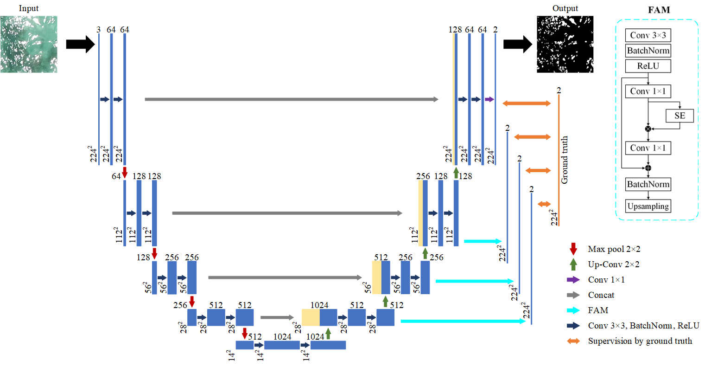
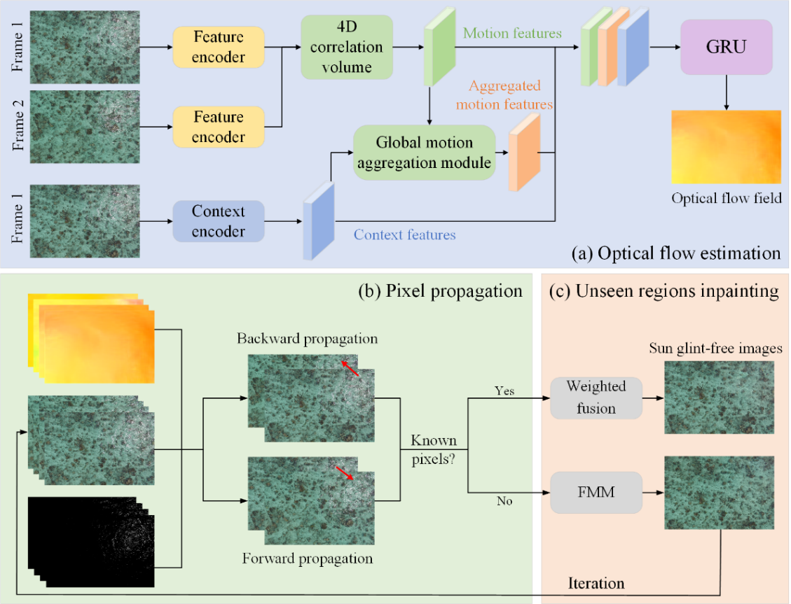

# Advancing sun glint correction in a deep learning pipeline for marine UAV color imagery

## Usage

### 1. Preparation

Please go to ["./Sun_glint_detection/dataset/sun_glint/README.md"] to prepare the dataset.

Please go to ["./Sun_glint_detection/utils/mypath.py] to modify the path.

Please go to ["./Sun_glint_contamination_restoration/data/README.md"] to prepare the dataset.

Please go to [google drive](https://drive.google.com/drive/folders/192BFjU5L97uiGavu6YHbfHzO1jpghWN7?usp=sharing) to download the weights.


### 2. Environment

Please prepare an environment with python=3.7, and then use the command "pip install -r requirements.txt" for the dependencies.

### 3. Sun glint detection

#### Train/Test
- Run the train script on sun glint dataset. 

```bash
cd Sun_glint_detection
python train.py --dataset sun_glint --use_balanced_weights --model fassnet
```

- If you have multiple GPUs, run:

```bash
python train.py --dataset sun_glint --use_balanced_weights --model fassnet --sync-bn True --gpu_ids 0,1
```
- To evaluate the performance of FASSNet, run:

```bash
python test.py --dataset sun_glint --model fassnet --sync-bn True --gpu_ids 0,1
```

### 4. Restoration of sun glint contaminated images

```bash
cd Sun_glint_contamination_restoration
cd tool
python sunglint_restoration.py --path ../data/glint --path_mask ../data/glint_mask --outroot ../result/glint
```

## Model
### Sun glint detection


### Restoration of sun glint contaminated images



## Result


